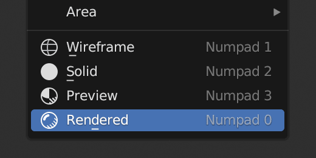

# VF-BlenderSetViewportShading
Adds view menu items and keyboard shortcuts for setting the current view mode (wireframe, solid, preview, and rendered)

## Installation and Usage
- Download [VF_setViewportShading.py](https://raw.githubusercontent.com/jeinselenVF/VF-BlenderSetViewportShading/main/VF_setViewportShading.py)
- Open Blender Preferences and navigate to the "Add-ons" tab
- Install and enable the Add-on
- It will show up at the bottom of the `View` menu of 3D viewports

The default keyboard shortcuts are for the number pad of a full size keyboard, but you can easily right-click any of the options to set your own.